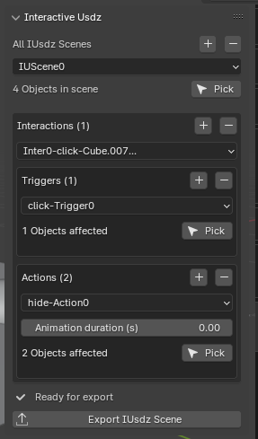
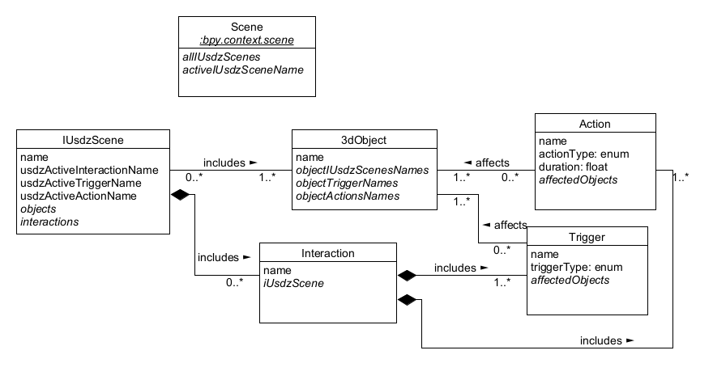

# Interactive USD addon for Blender
- prepares USDZ file that allows to click on objects and hide/show them in real-time AR iOS view (more features in the future)
- existing solution (Reality Composer) is useless as there is no ability to select objects in the outliner, and it requires to pick objects in 3D viewport 🤦‍♂️
- will add more info when I have more time.

## Example result of interactive USDZ

## Addon preview

## Usage
- clone the repo, open main.py in Blender Text Editor and run the script.
- After clicking on Export IUsdz Scene, to finish the model preparation, run PropsToUsdz.py from back-end folder (I wanted to make the script commercial and run back-end on remote server, however later realized, no one will need it ): ) 
- I hope the UI is intuinive enough to understand how the addon works.

## Notes
- We separate each USDZ file by groups of Interactions, I call them IUSDZ scenes.
- Interaction is just an Object that stores Triggers and Actions.
- Triggers and Actions store objects that they affect.

## Sketch Class Diagram

